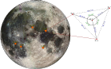
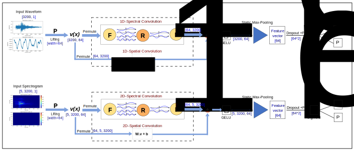

# [Fourier Neural Operator for Moonquake Detection](https://doi.org/10.1029/2025EA004792)
<div align="center">
  <a href="https://orcid.org/0009-0000-4863-2195" target="_blank">Basem Al-Qadasi<sup>1</sup></a> &emsp;
  <a href="https://orcid.org/0000-0002-5189-0694" target="_blank">Umair Bin Waheed<sup>1</sup></a>
</div>
<div align="center">
  <sup>1</sup> Department of Geosciences, King Fahd University of Petroleum and Minerals, Dhahran, Saudi Arabia
</div>

<div align="center">
  <a href="https://github.com/basemqadasi/lunar-seismic-fno"></a>
  <a href="https://github.com/basemqadasi/lunar-seismic-fno/forks"></a>
  <a href="https://github.com/basemqadasi/lunar-seismic-fno"></a>
  <a href="https://github.com/basemqadasi/lunar-seismic-fno/commits/main"></a>
  <a href="https://doi.org/10.1029/2025EA004792"></a>
  
  
</div>

Official implementation of the paper "Fourier Neural Operator for Moonquake Detection." The repository provides two lunar seismic event detection pipelines built with Fourier Neural Operators (FNOs):

- a 1D FNO for waveform windows
- a 2D FNO for spectrogram patches

The code is organized for reproducible training and evaluation while keeping datasets and trained weights outside Git history.

## Summary
Studying Moonquakes provides significant insight into the internal structure of the Moon. However, only a limited number were recorded during the Apollo missions, and those recordings are noisy, so many events are hard to detect with standard algorithms. We tested an advanced deep learning approach that looks for patterns in the frequency content of seismic signals (called Fourier Neural Operators) to spot moonquakes even when there are few clean examples to learn from. We trained two versions of the model—using the raw seismic waveforms and using spectrograms—on earthquake data plus a small set of labeled moonquakes. We then evaluated performance on independent Apollo datasets. Both models detected moonquakes accurately while raising few false alarms, and they can handle signals of different lengths and sampling rates. Because the models are small and fast, they could be used for near real-time monitoring on future lunar missions and may also help classify seismic activity on Mars.

<p align="center">
  
</p>
<p align="center">
  <em>Figure 1. The Apollo mission PSE seismic stations (A-15—A-16), and the inset represents the Apollo-17 LSPE geophone array geometry. The background is a composite image of the moon using Clementine data from 1994, Credit goes to NASA. The locations of the Apollo five stations are taken from Wagner et al. (2017); Haase et al. (2019); Onodera (2024). The geometry of the LSPE geophone array is adapted from Haase et al. (2019)..</em>
</p>

## Reference
Al-Qadasi, B., & Waheed, U. B. (2026). *Fourier Neural Operator for Moonquake Detection*. *Earth and Space Science*, 13(3). https://doi.org/10.1029/2025EA004792

```bibtex
@article{alqadasi2026moonquake,
  title   = {Fourier Neural Operator for Moonquake Detection},
  author  = {Al-Qadasi, Basem and Waheed, Umair Bin},
  journal = {Earth and Space Science},
  volume  = {13},
  number  = {3},
  year    = {2026},
  month   = mar,
  doi     = {10.1029/2025EA004792},
  url     = {https://doi.org/10.1029/2025EA004792}
}
```

## Install
Create an environment and install the package in editable mode:

```bash
python -m venv .venv
source .venv/bin/activate
pip install -U pip
pip install -e .
```

The project requires Python 3.9+ and depends on `numpy`, `pandas`, `torch`, `scikit-learn`, `matplotlib`, and `PyYAML`.

Optional repository checks:

```bash
./release_check.sh
```

## Data preparation
The training and evaluation NPZ files used by this repository are hosted on Figshare:

- Dataset DOI: <https://doi.org/10.6084/m9.figshare.30209080.v1>

Expected files:

| File | Primary use | Required keys |
| --- | --- | --- |
| `Combined_EQ_MQ64_data.npz` | waveform training/validation | `waveform_data`, `waveform_labels` |
| `EQ_event_noise_data_.npz` | spectrogram training/validation | `spectrogram_data`, `spectrogram_labels` |
| `PSE_MQ_test_data.npz` | moonquake evaluation | modality-matching keys |

Suggested local layout:

```text
/path/to/lunar_fno_data/
  Combined_EQ_MQ64_data.npz
  EQ_event_noise_data_.npz
  PSE_MQ_test_data.npz
```

After download, update the machine-specific paths in the YAML configs:

- `configs/waveform_default.yaml`
- `configs/spectrogram_default.yaml`

The current training entrypoints read these path fields:

- `paths.eq_npz`
- `paths.mq_npz`
- `paths.x_key`
- `paths.y_key`
- `paths.output_dir`

Recommended config mapping:

1. For waveform runs, set `paths.eq_npz` to `Combined_EQ_MQ64_data.npz`, `paths.mq_npz` to `PSE_MQ_test_data.npz`, `paths.x_key` to `waveform_data`, and `paths.y_key` to `waveform_labels`.
2. For spectrogram runs, set `paths.eq_npz` to `EQ_event_noise_data_.npz`, `paths.mq_npz` to `PSE_MQ_test_data.npz`, `paths.x_key` to `spectrogram_data`, and `paths.y_key` to `spectrogram_labels`.
3. Keep data files outside the repository and do not commit NPZ artifacts.

Accepted array shapes and the data contract are documented in `docs/data_contract.md`.

## Model and repository structure
This repository contains two FNO-based classifiers:

<p align="center">
  
</p>
<p align="center">
  <em>Figure 2. Model architecture used for waveform and spectrogram FNO-based moonquake detection.</em>
</p>

- `src/lunar_fno/models/fno1d.py`: 1D FNO classifier for waveform sequences
- `src/lunar_fno/models/fno2d.py`: 2D FNO classifier for spectrogram inputs
- `src/lunar_fno/data/`: dataset adapters for waveform and spectrogram NPZ files
- `src/lunar_fno/train/`: training and evaluation entrypoints for both modalities
- `src/lunar_fno/utils/`: reproducibility, metrics, and IO helpers
- `configs/`: default experiment configuration files
- `scripts/`: shell wrappers for the main train commands
- `docs/`: project structure, data contract, and reproducibility notes

Default training settings in the checked-in configs include:

- seeds: `42`, `7`, `101`, `2025`
- epochs: `1500`
- batch size: `32`
- optimizer: `AdamW`
- learning rate: `1e-3`
- early stopping patience: `20`
- scheduler: `ReduceLROnPlateau`

## How to run the training code
Waveform model:

```bash
python -m lunar_fno.train.train_waveform --config configs/waveform_default.yaml
```

Spectrogram model:

```bash
python -m lunar_fno.train.train_spectrogram --config configs/spectrogram_default.yaml
```

Helper scripts are also provided:

```bash
bash scripts/run_waveform.sh
bash scripts/run_spectrogram.sh
```

Each run creates its output directory automatically. By default, results are written under:

- `./outputs/waveform`
- `./outputs/spectrogram`

Saved artifacts include:

- `models/best_model_seed{seed}.pth`
- `models/final_model_seed{seed}.pth`
- `training_history_seed{seed}.csv`
- `metrics_eq.csv`
- `metrics_mq.csv`
- `early_stopping.csv`
- ROC and confusion-matrix figures under `EQ_results/` and `MQ_results/`

## Reproducibility
For an end-to-end run checklist, see:

- `docs/reproducibility.md`
- `docs/project_structure.md`
- `docs/data_contract.md`

The repository uses deterministic seed control where practical, but exact reruns can still vary across hardware, CUDA, driver, and PyTorch versions.

## Development
Contributions that improve documentation, reproducibility, or model quality are welcome. For code or workflow issues, please open a GitHub issue or submit a pull request.

## License
MIT. See `LICENSE`.
